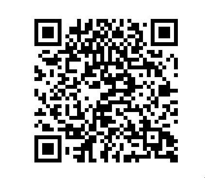

# 基於 Obesity 資料集的決策樹與隨機森林練習

## 資料描述

- 用途描述：藉由飲食習慣與身體狀況預測肥胖等級
- 資料來源地理區域：歌倫比亞、秘魯、墨西哥
- 資料來源：[UCI dataset - Estimation of obesity levels based on eating habits and physical condition Data Set][source]
- 捐贈日期：2019-08-27
- 紀錄筆數：2111 筆，其中 498 筆為真人填寫之網路問卷（～23% ）、1613 筆為 SMOTE 演算法人工合成之資料（～77% ）
- 缺失值：（無）

## 資料期刊文章

- [資料集發表文章](https://www.sciencedirect.com/science/article/pii/S2352340919306985?via%3Dihub)
- [資料集應用文章](https://thescipub.com/pdf/jcssp.2019.67.77.pdf)

## 內容

- 針對資料集的描述性統計
- 決策樹與隨機森林的建立
- 建基於 Obesity 資料集與隨機森林預測模型的健康預警 Line 機器人

註：藉由以下 QRcode 把 LineBot 加入好友開始使用（如果我伺服器有開的話啦）

聯絡方式： zheruiyang@gmail.com
